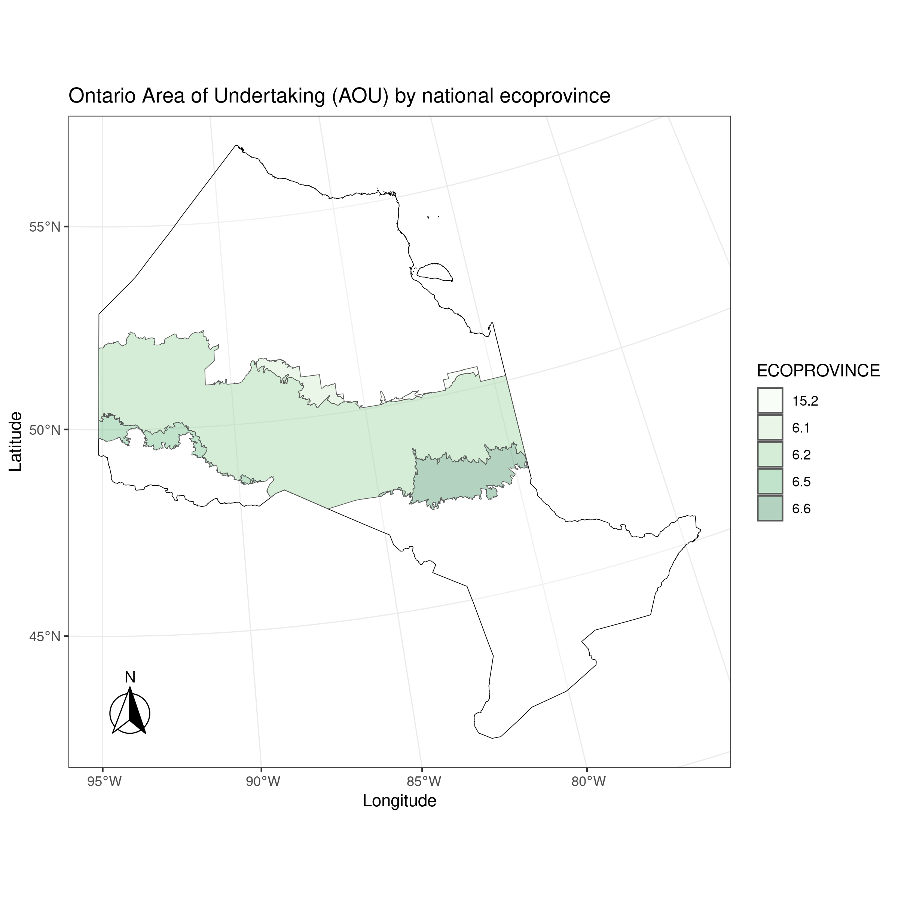
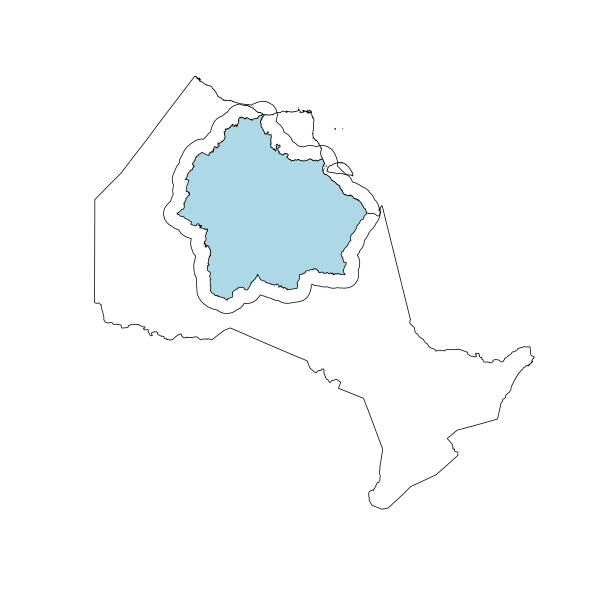

# Ontario_AOU_ROF

Simulation modelling of vegetation and fire dynamics in the Ontario Area of Undertaking (AOU) and the Ring of Fire (ROF) regions.

## Study Areas

## Modules

### Study area

- [FOR-CAST/Ontario_preamble](https://github.com/FOR-CAST/Ontario_preamble)

### Forest vegetation dynamics (`LandR`)

- [PredictiveEcology/Biomass_borealDataPrep](https://github.com/PredictiveEcology/Biomass_borealDataPrep)
- [PredictiveEcology/Biomass_core](https://github.com/PredictiveEcology/Biomass_core)
- [PredictiveEcology/Biomass_regeneration](https://github.com/PredictiveEcology/Biomass_regeneration)
- [PredictiveEcology/Biomass_speciesData](https://github.com/PredictiveEcology/Biomass_speciesData)

### Fire dynamics (`fireSense`)

- [PredictiveEcology/fireSense](https://github.com/PredictiveEcology/fireSense)
- [PredictiveEcology/fireSense_dataPrep](https://github.com/PredictiveEcology/fireSense_dataPrep)
- [PredictiveEcology/fireSense_IgnitionFit](https://github.com/PredictiveEcology/fireSense_IgnitionFit)
- [PredictiveEcology/fireSense_IgnitionPredict](https://github.com/PredictiveEcology/fireSense_IgnitionPredict)
- [PredictiveEcology/fireSense_EscapeFit](https://github.com/PredictiveEcology/fireSense_EscapeFit)
- [PredictiveEcology/fireSense_EscapePredict](https://github.com/PredictiveEcology/fireSense_EscapePredict)
- [PredictiveEcology/fireSense_SpreadFit](https://github.com/PredictiveEcology/fireSense_SpreadFit)
- [PredictiveEcology/fireSense_SpreadPredict](https://github.com/PredictiveEcology/fireSense_SpreadPredict)

### Tree species

1. Black spruce (`PICE.MAR`)
2. Jack pine (`PINU.BAN`)
3. poplar (trembling + balsam) (`POPU.TRE` + `POPU.BAL`)
4. white birch (`BETU.PAP`)
5. balsam fir (`ABIE.BAL`)
6. larch (`LARY.LAR`)
7. cedar (`THUJA.SPP.ALL`)
8. white spruce (`PICE.GLA`)
